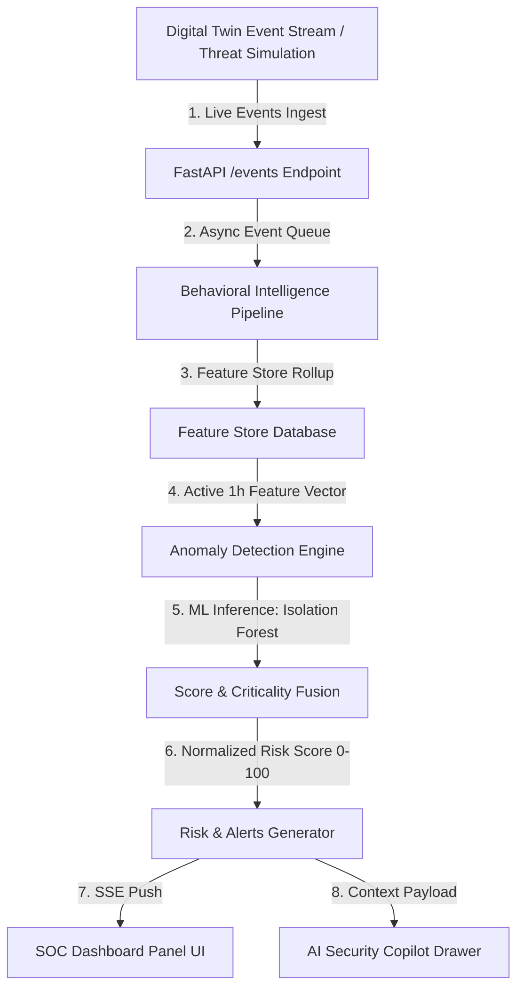
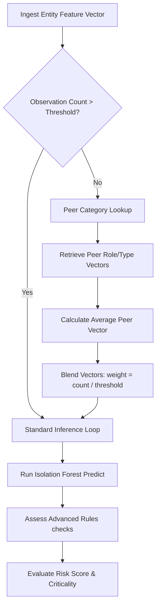
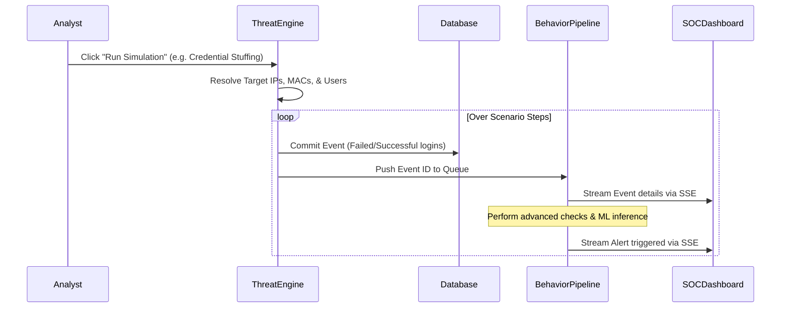

# AegisOne: Technologies & Implementation Methodology

This document outlines the software stack, data workflows, and architectural processes powering AegisOne.

---

## 1. Technologies Used

AegisOne leverages a modern, decoupled tech stack optimized for low-latency streaming and high-fidelity anomaly detection:

### Backend Architecture
- **Programming Language**: `Python 3.11+`
- **Application Framework**: `FastAPI` (provides asynchronous request handling, high concurrency, and automatic OpenAPI schema validation).
- **ASGI Web Server**: `Uvicorn` (monitored and managed locally or in container runtimes).
- **ORM / Database Adapter**: `SQLAlchemy 2.0` (with connection pooling) & `psycopg2-binary` (PostgreSQL driver).
- **Database Migrations**: `Alembic` (handles database versioning and schema updates).

### Analytics & Machine Learning
- **Anomaly Detection**: `Scikit-Learn` (Isolation Forest wrapper).
- **Numeric Vector Operations**: `NumPy` & `SciPy` (mathematical vector aggregation and Haversine geodetic distance calculations).

### Frontend Console
- **Framework & Libraries**: `React 19` & `TypeScript` (ensures type safety across pages).
- **Build Tool / Bundler**: `Vite` (fully optimized production assets bundle in under 1 second).
- **Styling Utility**: `Tailwind CSS v4` & `Vanilla CSS` (dark-theme glassmorphism and clean animations).
- **Vector Icons**: `Lucide React`.

### Data Layer & Hosting
- **Relational Database**: `PostgreSQL` (Neon Serverless PostgreSQL in production).
- **Real-Time Data Push**: `Server-Sent Events (SSE)` (provides unidirectional HTTP streaming for active alerts, network topology status, and terminal timeline logs).
- **Cloud Infrastructure**: `Render` (Backend Uvicorn Service) & `Vercel` (Frontend static CDN hosting).

---

## 2. Implementation Methodology & Process

The core behavioral intelligence loop operates on continuous event streams rather than static snapshots. Below are the implementation process flowcharts:

### System Data Flow Architecture

### Anomaly Prediction & Cold Start Logic

### Threat Simulation Engine Lifecycle

